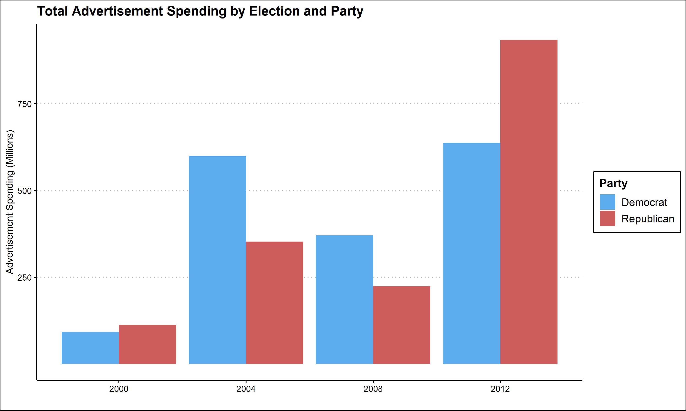
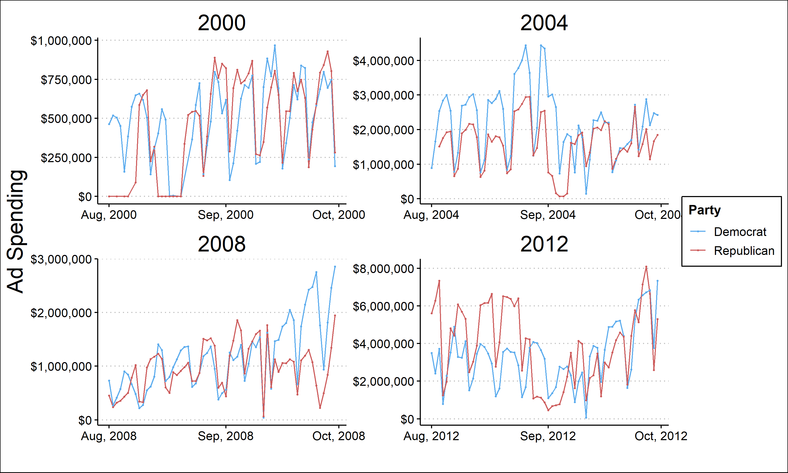

In this week's blog post I will examine the most public facing aspect of an election, the campaigns themselves. One factor of a campaign that voters interact with frequently is advertisements. In 2016, each party spent hundreds of millions of dollars on advertising. I will explore how effective that campaign spending (and other campaign's) was, what the best time to spend money on ads is, and then examine campaign advertising in 2020. 

Graph of campaign spending by election 

graph of when campaigns spend money

model of if it helps and when helps

state level model for 2020