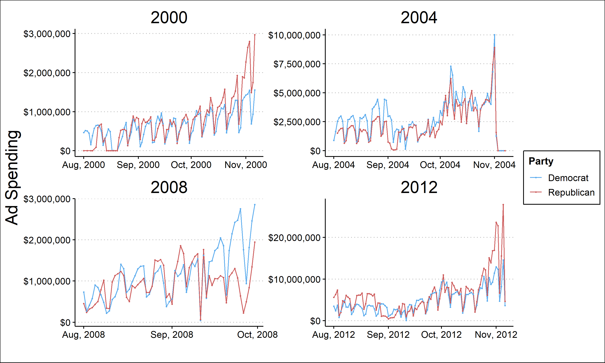
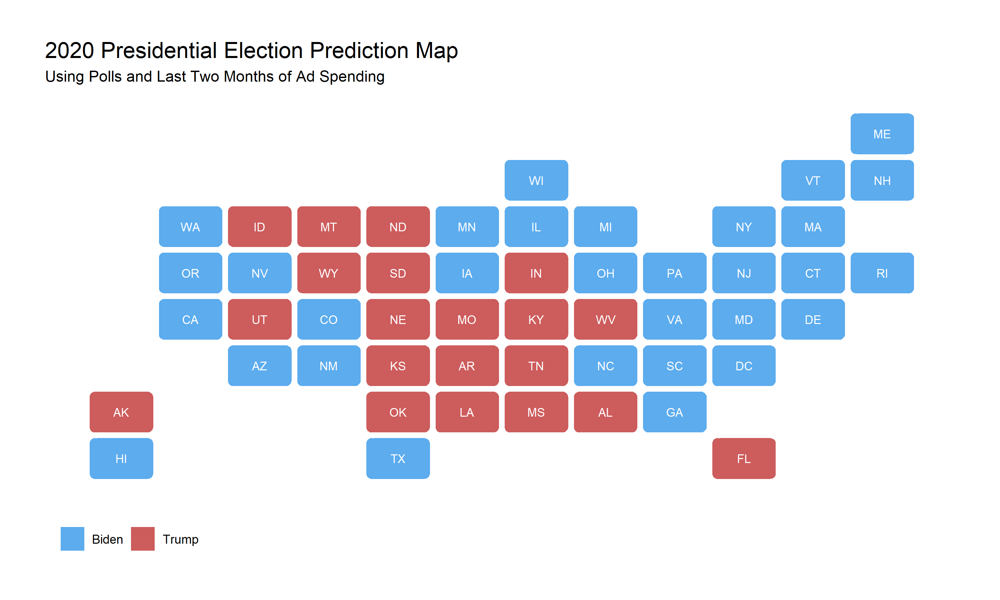

In this week's blog post I will examine the most public facing aspect of an election, the campaigns themselves. One factor of a campaign that voters interact with frequently is advertisements. Politicians and their parties care immensely about advertisements, going so far as to spend hundreds of millions of dollars on advertising each election cycle. In this blog I will explore **if campaign spending can be used to predict election outcomes, what the best time to spend money on ads is, and then use campaign advertising in a model to predict the 2020 election outcome.** 

## Advertisement Spending

In every presidential election from 2000 to 2004 both parties spent large sums of money on advertising. This spending varied drastically by state and time, giving some clue that **campaigns strategically invest in advertisements.** Research from Alan Gerber and Gregory Huber confirms this prediction and gives evidence that **political advertising can in fact have a persuasive effect on voters.** Knowing this, I will explore how much campaigns have been spending 

From these graphs it is clear that campaigns tend to spend more as the election gets closer. **Spending in October appears to be significantly higher than earlier months.** This could be explained by a belief that voter's who see advertisements closer to the election are more likely to be persuaded by the advertisement. To answer the question of whether advertisement spending can be used to predict election results, and when advertisements are most effective, I will create **a model incorporating polling and advertisement spending to predict state level vote shares.**

These models show some very interesting, and somewhat unintuitive results. The first model is based only on poll averages from 5-11 weeks before the election. This model, which I have explored in the past, works decently well. **The R squared value of 0.78 for Republicans and 0.83 for Democrats shows that the polls can explain 78% and 83% respectively of variance in the state two party vote share.** Interestingly, adding total advertisement spending to the model increases the R squared value slightly and also decreases the mean squared error (a measure of fit) for both models. This suggests that **adding ad spending makes the model better.** However, adding only the last two months of ad spending, which I predicted to be the most important for election outcomes, decreases the R squared value. On the other hand, the MSE decreases significantly which suggests that this model actually fits the data better. **For this reason, I think the polls combined with the last two months of ad spending is the best model of these three and I will use it moving forward.**

## Predicting 2020

Using the polls and last two month ad spending model, I will predict the outcome of the 2020 election at the state level. Due to data constraints, namely that data for the last month of ad spending is not available, I will only be using the advertisement spending from September. 

This model predicts an overwhelming victory for Biden. In this model **Biden wins 392 electoral votes and Trump wins only 146.** Every swing state, aside from Florida, and including Texas and south Carolina swings towards Biden. This result, while fairly accurate when predicting historical outcomes, **predicts a very unlikely outcome.** Do to these seemingly inaccurate predictions, I would not trust this model. However, even if this model is not correct, it does still suggest that Biden has an advantage in many crucial swing states.  