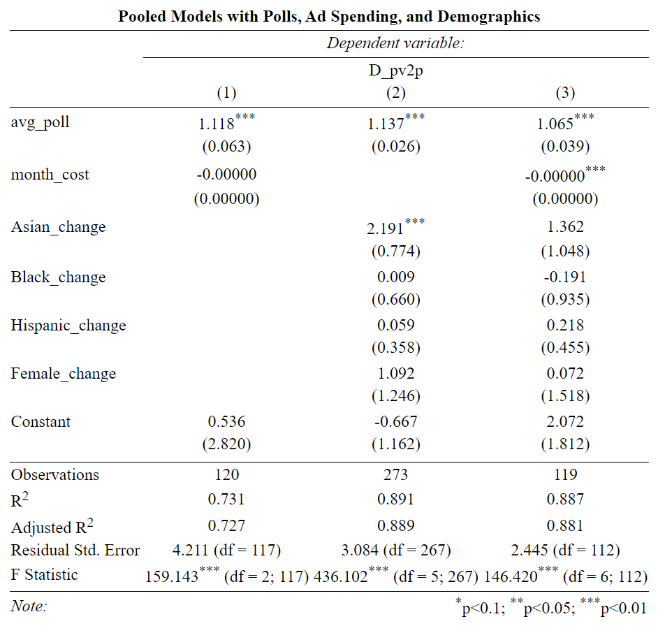
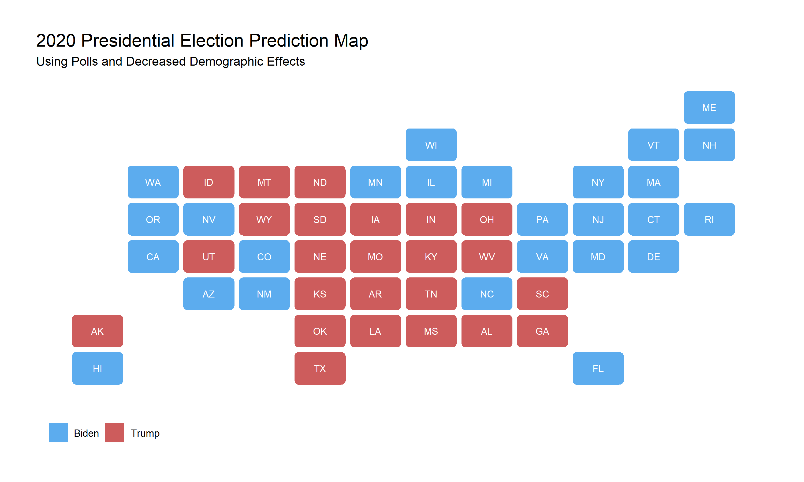

One of the most frequently discussed factors in voting is demographics. In this week's blog post I will **explore the effect that demographic change has had on historical voting behavior, create an updated prediction model for the 2020 election, and then predict the election outcome accounting for potential surges in certain demographics.** 

## Models

Over the past several weeks I have developed a variety of models relying on factors ranging from economic fundamentals to advertisement spending. This week, I will create new models incorporating **demographic information** and compare it to my previous model which relied on ad spending and polls. The first model below is a recreation of last week's model considering only state polling and state ad spending, the second model includes state polling and state demographics, the third model includes polling, demographics, and ad spending. I decided to use a **pooled model** for each of my models so that the model would be built on a larger number of observations and so that I could predict states that lack frequent polling. 

From this table, it appears that **both models that include demographic information perform better than last week's model** which only used polling and ad spending. Between the two models that include demographic information there is not much variation. **The adjusted r squared value of 0.889 for the second model is slightly higher than the third model's.** However, the residual standard error of the third model is significantly lower than the second's at 2.445 and 3.084 respectively. In order to determine which one of these models I will use moving forward I will conduct **out of sample testing** to determine how well each model is able to predict state outcomes. 

While the models remain very close in their average prediction error and correct prediction percentage, the second model which relied on only polls and demographics is slightly more accurate. While the difference between **0.88* and **0.85** is not large, I believe employing a model that relies on fewer variables, more observations, and a higher correct prediction percentage is the best choice. 

## Predicting 2020

Using the second model and data from 2020, I predict a landslide victory for Biden. In this unlikely outcome, Biden wins **440 electoral votes,** and almost every swing state including Texas, Mississippi, and Alaska, all of which are considered to be solidly Republican. Similarly to previous weeks, this outcome seems very unrealistic and may be a result of relying too much on demographic information despite the effect of demographic changes not being uniformly statistically significant in my model. To account for this potential flaw, I created a second model in which the **effect of all demographic categories on the Democrat's two party vote share is decreased by 5%.** While this may seem like a large amount, turnout among Black voters decreased by 7% from 2012 to 2016 and overall turnout decreased by 2% despite an increase among white voters. [Pew](https://www.pewresearch.org/fact-tank/2017/05/12/black-voter-turnout-fell-in-2016-even-as-a-record-number-of-americans-cast-ballots/) 

In this second prediction accounting for a potential decrease in the effect of most demographic groups on Biden's vote share the outcome is much closer. In fact, in this prediction Biden wins only **334** electoral votes and **wins Florida and Arizona by less than 2% of the two party vote.** While a 5% decrease might be a large estimate, this new result shows that my model is fairly sensitive to change and for that reason might not be as solid as the adjusted r squared and correct prediction percentage indicated. In next week's blog, as we come ever closer to the election, I will update this model to be as complete as possible. 