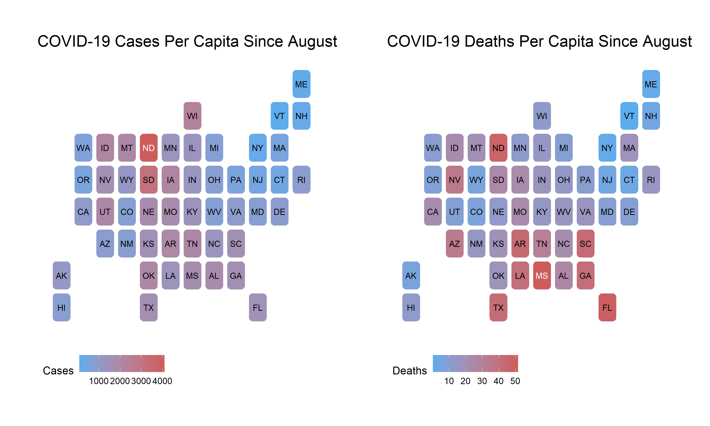
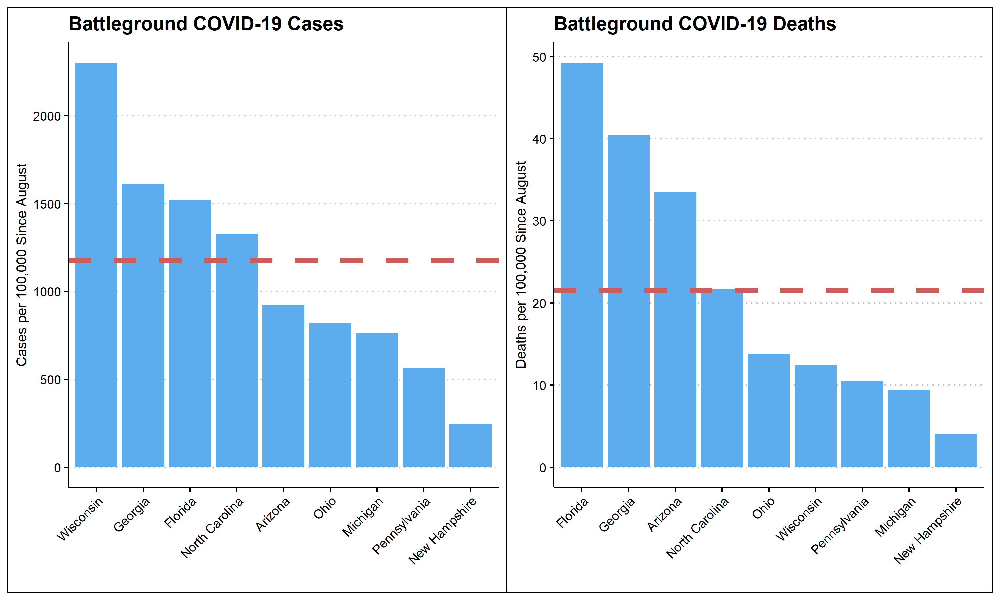

With less than two weeks until election night, I will finally discuss **the effects COVID-19 might have on this year's presidential election outcome.** COVID-19 is at the front of every voter's mind; it has changed our economy, our voting, and the way we live our lives. Many blame the severity of the pandemic on Donald Trump's response, while others argue that the over 200,000 American deaths due to the virus were inevitable. **This week I will discuss the potential impact this unprecedented shock might have on voting patterns around the US.** 

## COVID-19 in the US

As seen above, the effects of the coronavirus have been felt in varying degrees around the country. Some states, such as Maine and Vermont have avoided a high density of both deaths and cases while other states such as **Georgia, Florida, and North Dakota have had much higher rates of deaths and cases.** While there is no obvious trend in where cases and deaths have occurred, it does seem that the highest density of COVID-19 deaths have occurred in the south in states such as Mississippi, Georgia, Florida, South Carolina, and Arkansas. However, most of these states are solidly partisan and will most likely continue to vote along party lines despite the shock of COVID. **To determine how much effect the coronavirus will have on the election it may be more beneficial to zoom in on the battleground states.** 

Once again, these graphs make apparent the varying severity of COVID-19 in each state. **Four of the most closely contested swing states, Wisconsin, Georgia, Florida, and North Carolina, all lie well above the nation's average case density** denoted by the red dotted line. Additionally, Florida, Georgia, and Arizona all lie above the national average of deaths per 100,000 people. On the other hand, many crucial swing states have avoided the worst of the pandemic and maintained a relatively low case and death density. While these graphs can more clearly show the differential effect of the pandemic in each swing state, they do not yet answer the question of how the will affect our election.

## COVID-19's Effect on National Polls

In an attempt to measure the effects of COVID-19 on each candidate's vote share, I created **a scatterplot of new deaths and cases and change in state levels poll estimates of Trump's vote share.** These graphs have the logged number of new cases or deaths in 7 day intervals on the x axis, and the change in national poll estimates for Trump's vote share subtracted from state poll estimates for Trump's vote share. **This subtraction is an attempt to control for factors other than the coronavirus that affected the entire nation such as debates or national conferences.** Additionally, each of these graphs **only uses data from after the month of August** as polling estimates become more accurate closer to the election.  

From these charts, it seems that **COVID-19 has no uniform effect on polling averages.** In some states, such as Florida, an increase in case and death density is strongly correlated with a decrease in Trump's polling averages. **However, in other states such as Georgia the relationship is reversed and an increase in COVID-19 deaths and cases is associated with an increase in Trump's polling averages.** This suggests that the effect of COVID-19 on polling may vary by state, or that it is potentially unrelated to polling in general. Even so, COVID-19 may have a large effect on the election. For example, **a decrease in voter turnout for certain demographic groups may not be reflected in polling numbers but could have a significant effect on actual vote share on election day.** Ultimately, it appears that **the effect of COVID-19 on the election is unpredictable and might only be determined in hindsight.** 

