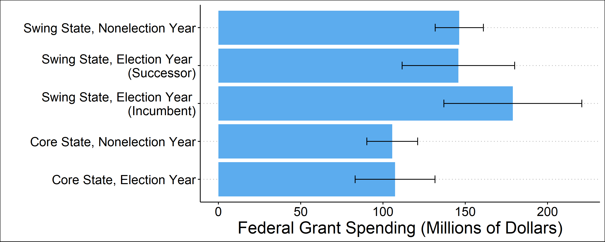
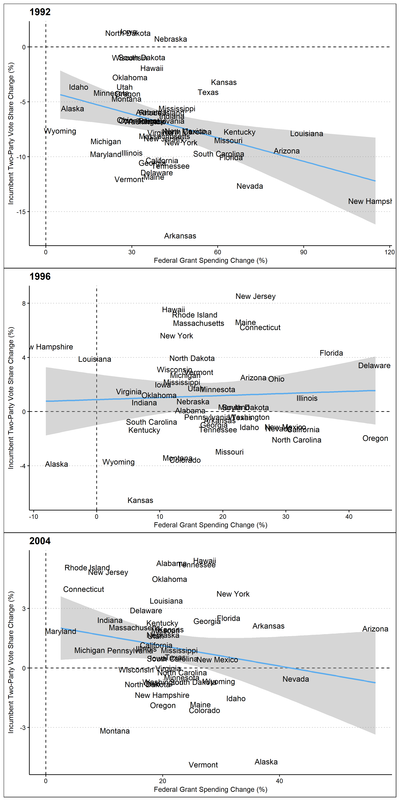

One key aspect of elections, especially presidential elections, are the advantages afforded to the incumbent. Presidential incumbents are more nationally recognized, receive more press coverage, and have **the power to allocate federal funds.** In fact, in their 2012 paper “The Influence of Federal Spending on Presidential Elections,” Douglas Kriner and Andrew Reeves find that an increase in federal spending increases the incumbent's vote share at the state level. **In this post, I will examine the effects of incumbency and develop a new national vote share model.** 

## Incumbent Advantage

Since 1948, when incumbent candidates run for president they have won **73%** of the time. Only George HW Bush, Gerald Ford, and Jimmy Carter have lost when running as an incumbent. Furthermore, incumbent candidates have won, on average, **53% of the two party popular vote.** While many explanations for the impressive performance of incumbent candidates have been offered, one of the most convincing is the incumbent's ability to influence voters by facilitating federal funding. 

In general, swing states receive more federal funding than non swing states. However, during election years when the incumbent is up for reelection, federal grant funding in swing states increases significantly from **around 150 to 180 million dollars.** This prominent difference suggests that when up for reelection, incumbent candidates attempt to influence critical swing state voters by increasing federal grant funding. To measure the effect of these efforts, I will examine how voting for an incumbent changed in response to federal grant spending increases. 

