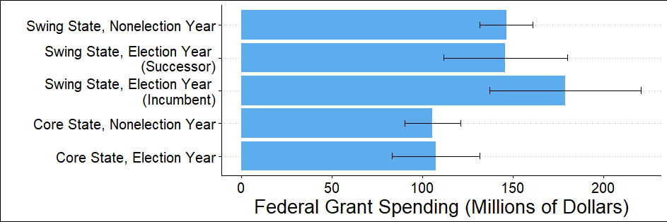
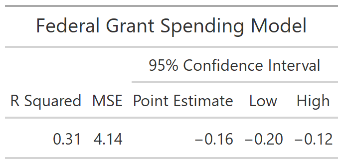

One key aspect of elections, especially presidential elections, are the advantages afforded to the incumbent. Presidential incumbents are more nationally recognized, receive more press coverage, and have **the power to allocate federal funds.** In fact, in their 2012 paper “The Influence of Federal Spending on Presidential Elections,” Douglas Kriner and Andrew Reeves find that an increase in federal spending increases the incumbent's vote share at the state level. **In this post, I will examine the effects of incumbency and then explain how these effects apply to Donald Trump.** 

## Incumbent Advantage

Since 1948, when incumbent candidates run for president they have won **73%** of the time. Only George HW Bush, Gerald Ford, and Jimmy Carter have lost when running as an incumbent. Furthermore, incumbent candidates have won, on average, **53% of the two party popular vote.** While many explanations for the impressive performance of incumbent candidates have been offered, one of the most convincing is the incumbent's ability to influence voters by facilitating federal funding. 

This graph shows that in general, swing states receive more federal funding than non-swing (core) states. However, during election years when the incumbent is up for reelection, federal grant funding in swing states increases significantly from **around 150 to 180 million dollars.** This prominent difference suggests that when up for reelection, incumbent candidates attempt to influence critical swing state voters by increasing federal grant funding. To measure the effect of these efforts, I will examine how an incumbent's two party vote share changed from one election to the next in response to federal grant spending increases in the same time frame. 

These graphs suggest a surprising trend. Not only does it appear that increasing federal funding to a state does not increase the incumbent's vote share, **it even appears that in 1992 and 2004 increasing grants actually harmed the incumbent.** While these results are certainly not intuitive, it may be that incumbents intentionally spend more money in states they are afraid to lose or perhaps the apparent trends are not statistically significant. To determine the validity of these results, I will apply a more statistical model to change in incumbent vote share and change in federal grant spending.

From this model, it appears that the change in federal spending at the state level is a decent predictor of change in incumbent vote share. **The R squared value of 0.31 suggests that 31% of the variance in change in incumbent tow party vote share is explained by changes in federal grants.** The estimate of -0.16 suggests that a 1% change in federal grant spending would decrease the incumbents two party vote share by 0.16 percentage points. **However, this model remains questionable for multiple reasons.** The first of these is the small sample size consisting of only three elections. Secondly, the results remain unintuitive which calls into question the legitimacy of the model. Putting these concerns aside for a moment, I will consider whether or not this model could even be applied in 2020. 

## Incumbency Advantage and Federal Spending in 2020

Without question, 2020 is a unique year. The incredible shock to the economy, and all citizens, presented by Covid-19 makes it hard to determine what models will remain relevant when predicting this election. For example, in my previous blog post on the economy it was made clear that **using measures such as GDP growth and RDI growth would not be possible in this election.** This may also be true when considering federal spending. For example, federal grant spending in Florida in 2020 (Covid relief funding) has increased 274% since 2008. In my model, this would predict a 40% decrease in incumbent two party vote share in the 2020 election. This prediction is clearly incorrect. Ultimately, due to the unique aspects of 2020, **using federal grant funding would not be an accurate way to predict vote share.** 
