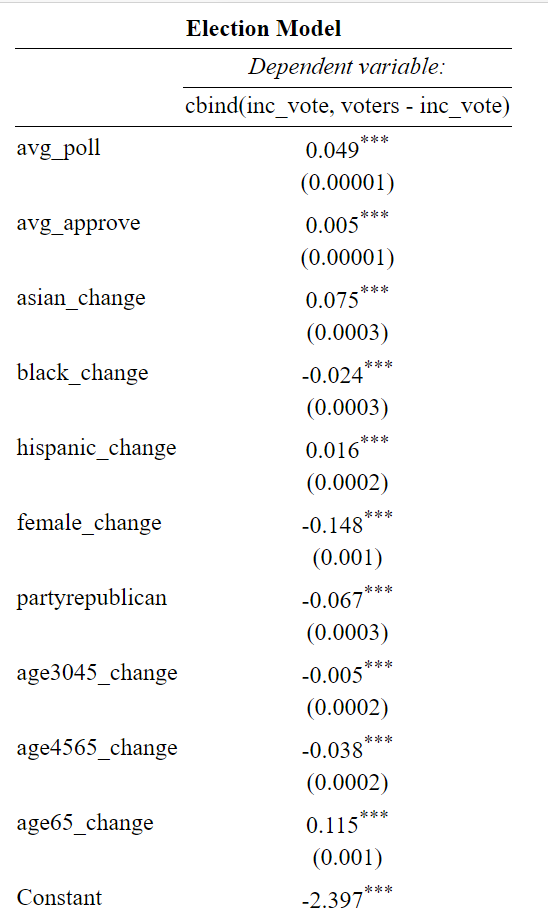
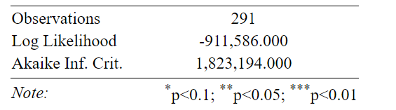
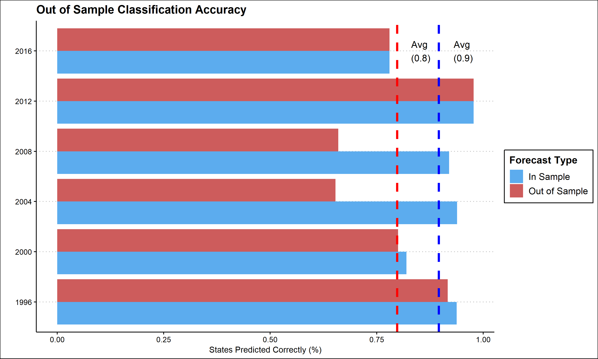
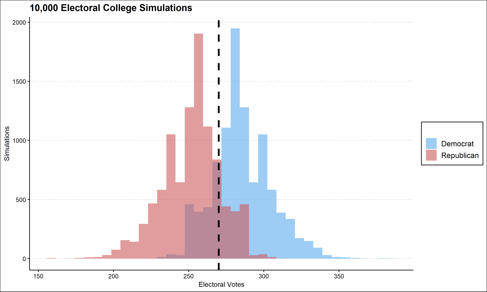
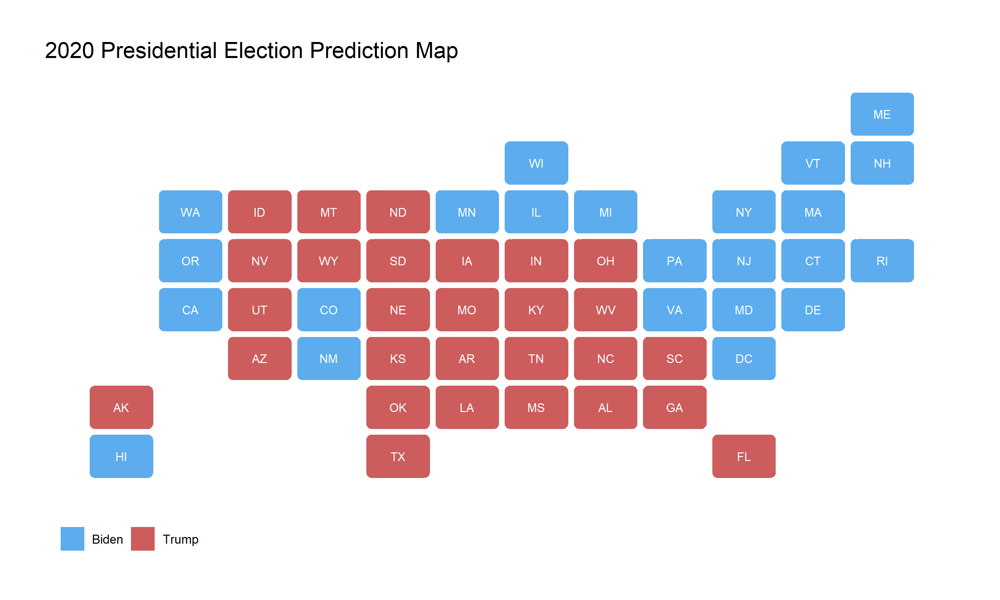

In this blog post, with only two days left until election night, I will make my final prediction for the outcome of the presidential race. Over the past few weeks I have made a variety of models and considered a wide range of variables. For my final election model, I have narrowed these variables down to **polling averages, presidential approval, incumbency, and demographic variables.** I have also decided to use a **probabilistic model,** specifically a binomial logistic regression, so that I can incorporate some of the randomness and uncertainty that is inherent in the election. 

## Model Discussion

This model was built using historical data dating from each presidential election from 1976 to 2016. The binomial logistic regression model I created relies on **polling averages from the last month before the election, average presidential approval ratings from the month before the election, the incumbent status of the president, and demographic changes.** Specifically, I calculated the percent change in a certain demographic group in each state over the four years between elections. For example, the "black_change" variable is the percent change in black population in a state between elections. **This modeling strategy is also beneficial as it predicts the number of votes for the incumbent candidate and cannot exceed the total voting eligible population of the state.** Now i will discuss the specific coefficients of this model. 

As seen above, each variable in this model is statistically significant. **The coefficients can be interpreted as the marginal increase in the odds of a voter turning out to vote for the incumbent party given a unit increase in the given variable.** For example, the coefficient on avg_poll, 0.049, means that a one point increase in average polling for the incumbent in the month before the election correlates with a 4.9% increase in the odds of a voter turning out to vote for the incumbent. **Using this interpretation for the other variables, an increase in approval rating and the percent of a population that is Asian, Hispanic, or over 65 also leads to an increase in the odds of a voter turning out for the incumbent. On the other hand, an increase in Black, female, or young population decreases the odds of a voter turning out for the incumbent.** Finally, if the incumbent party is Republican, the likelihood of a voter turning out for the incumbent decreases. 

## Model Fitness

To evaluate the effectiveness of this model, I conducted both in-sample and out-of-sample forecasting. I conducted both forms of fitness testing for every state in each year from 1996 - 2016. **The correct state level popular vote outcome was predicted 80% of the time out-of-sample and 90% of the time in-sample.** This shows that, while not perfect, this model has a reasonably high classification accuracy. Therefore, I will use this model and data from 2020 to predict the 2020 election.

## Predicting 2020 

Pictured below are the results of 10,000 election simulations. When predicting vote shares, I determined the likelihood of a single voter voting for the incumbent by randomly choosing a number from a normal distribution centered at the predicted value from my model with a standard deviation equal to the standard deviation of state level polls. **This method incorporates the uncertainty of state polling which guarantees that my prediction is not unreasonably certain.** 

**Of these 10,000 simulations, Biden achieved 270 electoral college votes in 78%. In the average prediction, Biden received 273 electoral votes,** and Trump received 265. Pictured below is the electoral map of the average prediction from the 10,000 simulations. 

In this prediction, Trump wins the swing states of Arizona, Florida, Georgia, and North Carolina while Biden wins Pennsylvania. In the simulations, Trump on average won 50.1% of the two party vote share. **In Florida, Georgia and North Carolina, Trump won by less than 2% on average.** This suggests that while the average result predicts a narrow Biden victory, Trump has a high chance to lose at least one of these swing states. **Ultimately, my election model predicts that Biden will win the election 78% of the time, and on average wins a narrow 273-265 victory in the electoral college.** 

