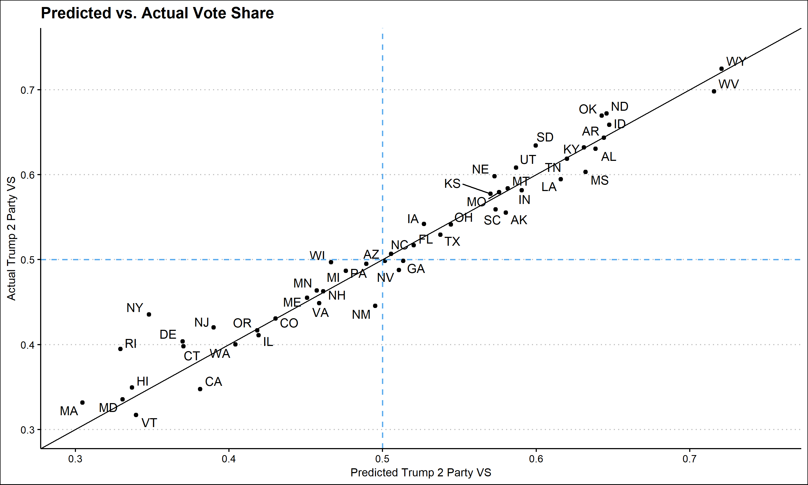
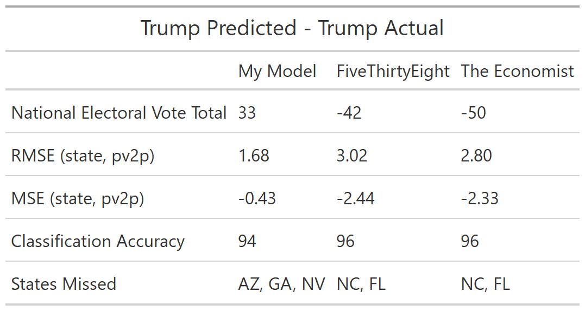

In this blog, almost three weeks after election night, I will reflect on my election model. Specifically, I will give a brief recap of my model, evaluate its performance compared to actual election results, and explore ways that my model could have been improved. 

## Model Recap

My model for predicting the 2020 election outcome was based loosely on the time for change model developed by Alan Abramowitz. Specifically, the model relied on **polling averages from the last month before the election, average presidential approval ratings from the month before the election, the party of the candidate, and demographic changes.** I also chose to use a binomial logistic regression as this modeling strategy predicts the number of votes for each candidate and cannot exceed the total voting eligible population of the state. 
This model was built to predict the number of votes for each party which was then **used to calculate the two party vote share by state.** Seen below are the election results predicted by model and the actual election results. 

**My model correctly predicted 48 of the 50 states and DC, only missing Nevada, Arizona, and Georgia.** While these maps are helpful for observing the most obvious misses in my model, in order to evaluate the model it may be more useful to look at each state individually. 

## Model Evaluation

To explore the effectiveness of my model, I graphed my **predicted two party vote share for Trump against the actual two party vote share.** It is also important to keep in mind that at the writing of this blog, not every state has finished counting votes. This is especially true in **New York where Trump's vote share is expected to decrease.**

Looking at this graph it appears that my model was fairly accurate at predicting states' vote share. **States in the bottom right quadrant, Arizona, Georgia, and Nevada, are states that I predicted for Trump but went to Biden.** The errors in prediction do not appear to by systematic, **many states overestimate Trump vote share and many underestimate it.** However, one noticeable pattern is that the **error in heavily democratic states appears to be larger than in battleground or heavily republican states.** Comparing my model to popular models from The Economist and FiveThirtyEight confirms some of these observations. 

