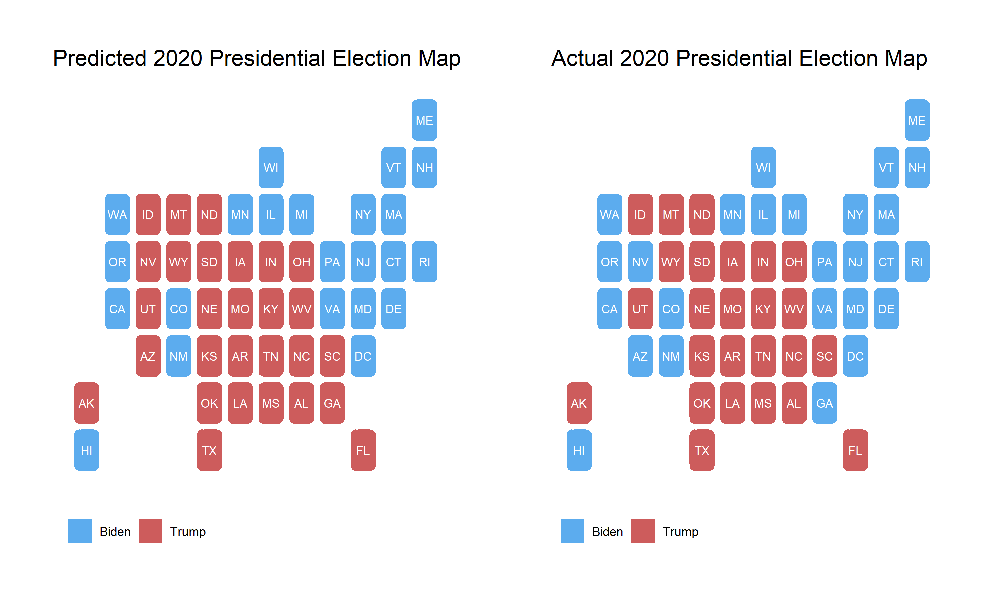

In this blog, almost three weeks after election night, I will reflect on my election model. Specifically, I will give a brief recap of my model, evaluate its performance compared to actual election results, and explore ways that my model could have been improved. 

## Model Recap

My model for predicting the 2020 election outcome was based loosely on the time for change model developed by Alan Abramowitz. Specifically, the model relied on **polling averages from the last month before the election, average presidential approval ratings from the month before the election, the party of the candidate, and demographic changes.** I also chose to use a binomial logistic regression as this modeling strategy predicts the number of votes for each candidate and cannot exceed the total voting eligible population of the state. 
This model was built to predict the number of votes for each party which was then **used to calculate the two party vote share by state.** Seen below are the election results predicted by model and the actual election results. 

**My model correctly predicted 48 of the 50 states and DC, only missing Nevada, Arizona, and Georgia.** While these maps are helpful for observing the most obvious misses in my model, in order to evaluate the model it may be more useful to look at each state individually. 

## Model Evaluation

To explore the effectiveness of my model, I graphed my **predicted two party vote share for Trump against the actual two party vote share.** It is also important to keep in mind that at the writing of this blog, not every state has finished counting votes. This is especially true in **New York where Trump's vote share is expected to decrease.**

Looking at this graph it appears that my model was fairly accurate at predicting states' vote share. **States in the bottom right quadrant, Arizona, Georgia, and Nevada, are states that I predicted for Trump but went to Biden.** The errors in prediction do not appear to by systematic, **many states overestimate Trump vote share and many underestimate it.** However, one noticeable pattern is that the **error in heavily democratic states appears to be larger than in battleground or heavily republican states.** Comparing my model to popular models from The Economist and FiveThirtyEight confirms some of these observations. 

My model, in contrast to the other models, **overestimated Trump's electoral vote count.** The root square mean error and mean square error of my model are both smaller than either of the other models' suggesting that **in general my state level two party vote shares were more accurate than other models.** However, the classification accuracy of my model was less than the others as **I incorrectly predicted three states rather than two.** Interestingly, despite overestimating Trump's electoral college votes, on average I underestimated his two party vote share as seen in the negative MSE value. This may be because the states that I incorrectly predicted had vote shares very close to 50%, while other states had larger errors in favor of Biden.  

## What Went Wrong?

### Sources of error

**I expect that my model relied too heavily on polling.** This may be especially true in heavily democratic states where polling was infrequent. For this reason my model might be relying too heavily on only a few results. For example, **my model predicted drastically different vote shares for New Jersey, Colorado, and New Mexico despite these states having similar election results.** This error is probably a result of polling. In the month before the election these states were polling at 36%, 40%, and 45% for Trump respectively. 

**Suggested reasons for the inaccuracy of polling include response differences by demographic, and "shy Trump voters."** In the first of these theories it is argued that polling does not do enough to capture a representative sample. David Shor, a data analyst, argued that poll respondents are unusual as they are part of a subset of the population that are willing to answer the phone and stay on and talk to pollsters. **Certain groups may be more likely to do this than others which would generate polling errors.** The second theory argues that because of social stigmas, Trump voters are more likely to lie about their voting preferences to pollsters. **This would generate a second source of error and systematically underestimate Trump's vote share.** I believe that both of these polling errors, combined with my models over-dependence on polls, could have caused the errors seen in my predictions. 

### Testing sources of error

If I were to conduct a test to evaluate whether or not polling errors led to my model's prediction errors, I would mainly look at two factors. **1) The number of polls in the month before the election in each state and 2) the polling error.** If my model performed significantly worse in states where there were very few polls in the month leading up to the election than in states with many polls, then I could confirm that this is a source of error. Secondly, if my model performed significantly worse in states where polls also performed poorly, than it would be likely that polling error led to my model's error. 

## Improving My Model

Overall, I am very satisfied with my model. **Only two states, New York and Rhode Island, incorrectly predicted the two party vote share by over 5%,** and I expect that as votes in New York get counted it will get closer to my prediction. However, I still think that my model could have been improved. I do not think that I would  remove any independent variables I did choose to include, but **I would add 2016 vote share to my model and change the weighting of these variables.** Specifically, I think that if I relied less heavily on polling in states where there were very few polls and more heavily on 2016 vote share, I may have had a more accurate model. 

