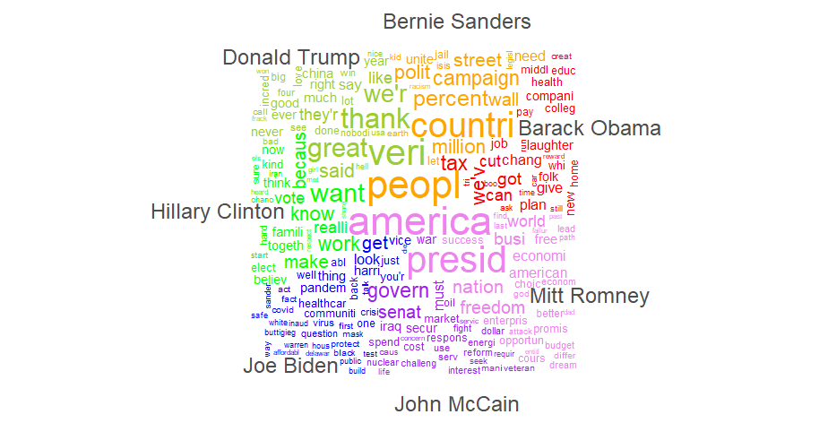
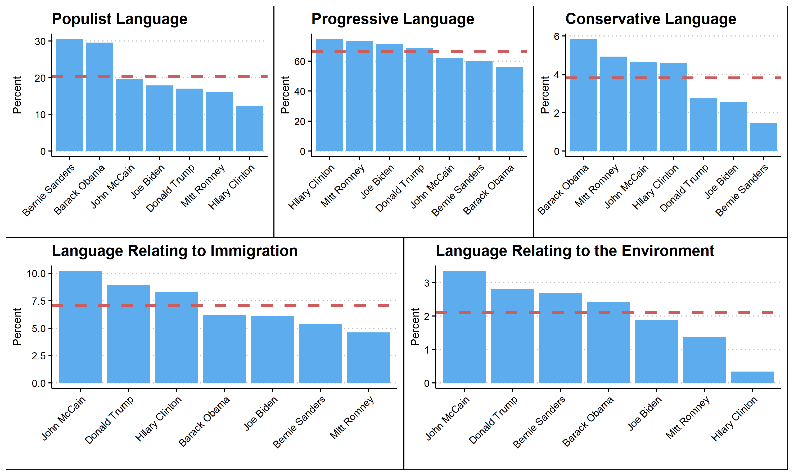
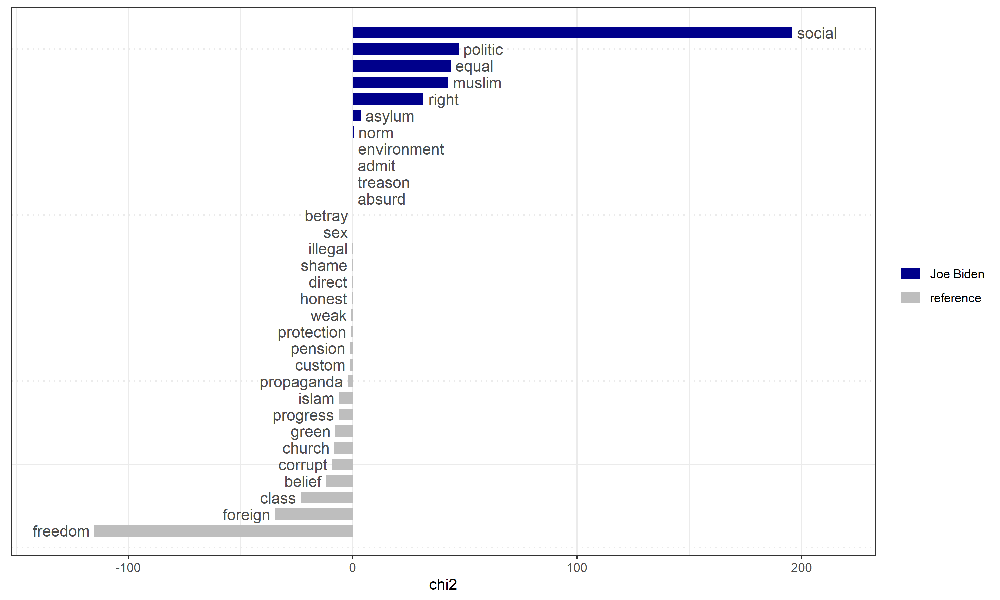
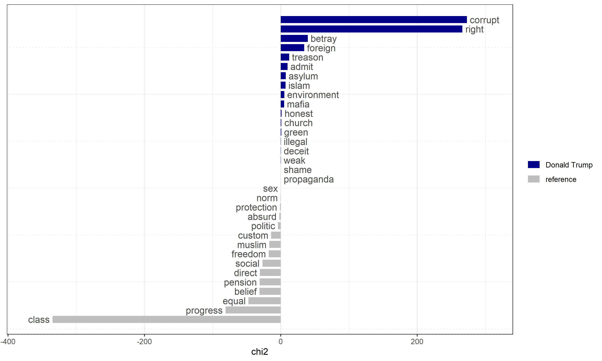
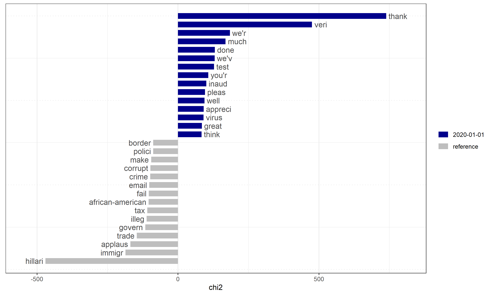
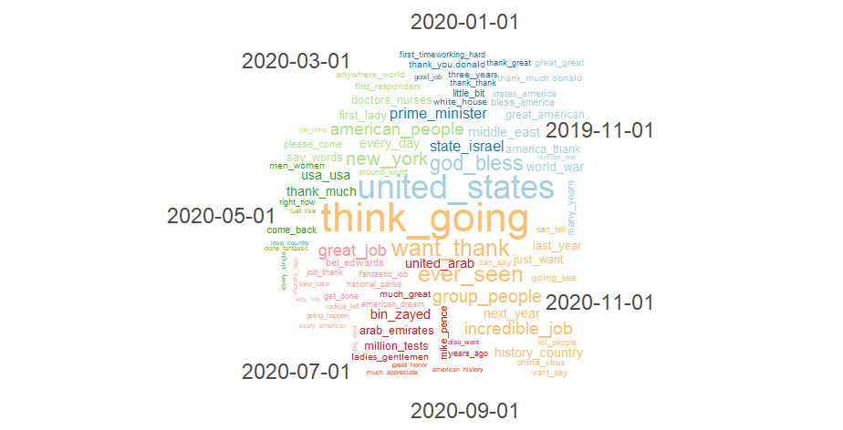
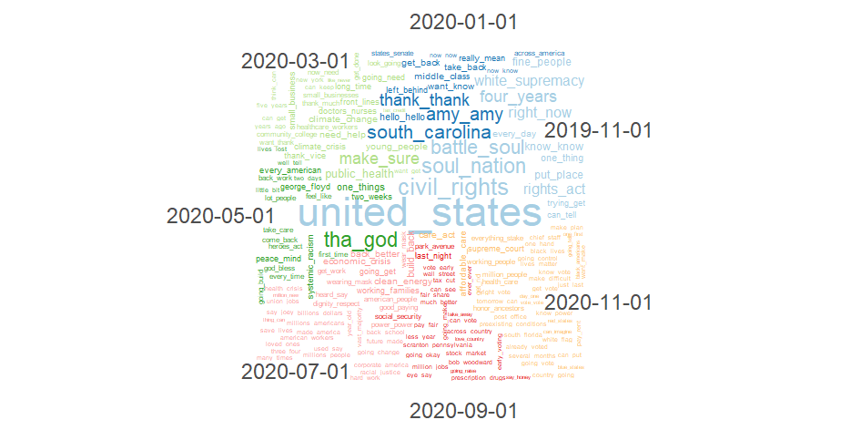

In this week's blog post I will be exploring the language used by presidential candidates, especially Trump and Biden. I will examine what words each candidate used the most and how Trump's and Biden's language usage changed over the course of their campaigns.  To conduct this exploration I used campaign speech transcripts from seven recent candidates. I used the quanteda r package to examine the specific words in each speech. 

## Word Usage by Candidates

The wordcloud above shows the most frequently used words for each of the seven candidates. Some interesting takeaways from this plot include Trump's usage of "China", Obama's usage of "afford", Sanders' usage of "union", and Biden's usage of "pandemic."

## Content Categories

Next, I wanted to explore what groups of words candidates were using rather than individual words. To do this, I used dictionaries created by Teun Pauwels in his 2011 paper "Measuring Populism: A Quantitative Text Analysis of Party Literature in Belgium." This paper includes dictionaries for populist, environemntalist, immigration, progressive, and conservative language. I plotted the relative percent of language in each of these categories for each candidate. 

I then wanted to further examine Trump and Biden's word usage within these categories. The charts below show both candidates relative word usage compared to all of the other candidates. 

## Language Over Time

Finally, I wanted to explore how each candidate's language usage has changed over time. To do so, I measured the words Trump used a relatively large amount this year as compared to his previous campaign. 

I also wanted to see how language usage changed over the course of the campaign. The wordclouds below show Trump and Biden's language usage split into two month increments. 

