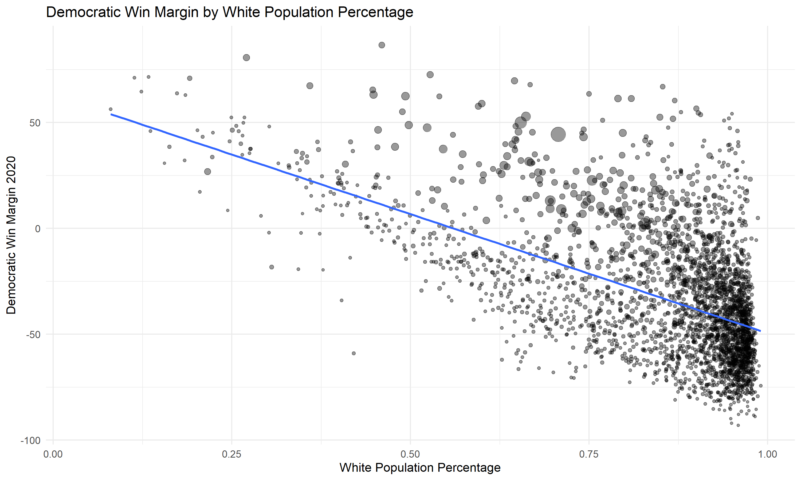
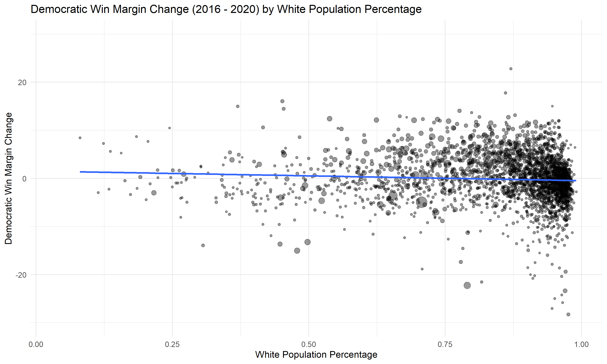
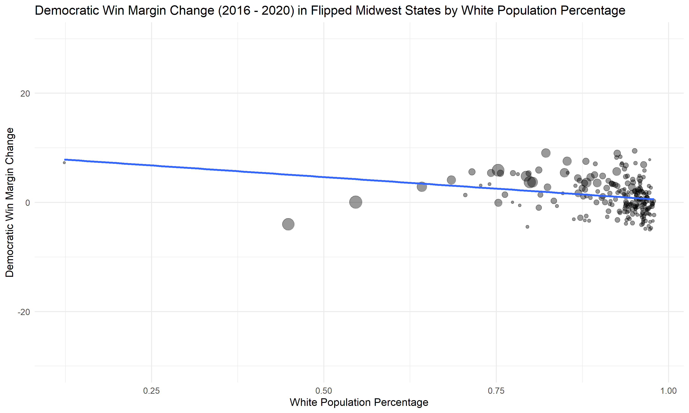

A month after Biden's historic presidential victory, various media outlets and pundits have begun to push narratives about why Biden won and how he could have done better. Some argue that Biden's win was inevitable because of Trump's unconventional character, others argue that Biden would have performed better if he had proposed more liberal policies, and yet more say that Biden's high-tech campaign was essential to his victory. In this blog post I will be exploring one specific narrative, **that Joe Biden won the election because of his appeals to working class white voters that voted for Trump in 2016.** Some examples of this narrative in popular media include:

* **The Atlantic**
  * "He won because he was a reaction to Trump, but also because he was a white guy who could connect with white guys" - [Why Biden Won](https://www.theatlantic.com/politics/archive/2020/11/why-biden-won-presidency/616980/) 

* **Harvard Business Review**
  * "Most importantly, Biden treated working-class whites with respect, which had been sorely lacking" - [How Biden Won Back (Enough of) the White Working Class](https://hbr.org/2020/11/how-biden-won-back-enough-of-the-white-working-class) 
  
* **Pittsburgh Post-Gazette**
  * "His goal was to draw in enough white working-class votes to win. Early returns show he did just that" - [Biden's blue-collar appeal brought in just enough white working-class votes to help him win Pa.](https://www.post-gazette.com/news/politics-state/2020/11/11/Biden-s-rural-blue-collar-voters-gains-pennsylvania-election/stories/202011110110) 
  
## Testing the Narrative

If this narrative were true, that Biden was able to win the election because of his appeal to white voters, then **we should see an increase in Democratic vote share in majority white counties between 2016 and 2020.** Specifically, the increase in vote share for Biden over Clinton should be bigger in relatively white counties compared to relatively non-white counties. To test this theory, **I will be looking at the change in democratic vote share by county and comparing it the percentage of white residents.** 

## The Data

To conduct this analysis, I collected data on vote share by county for both 2016 and 2020. I also collected demographic data from the Census Bureau from 2019. I used this data to determine the democratic win margin in each county, the change in democratic win margin from 2016 to 2019, and the percentage of each county that was white in 2019. 

## Results

To test this narrative, I first looked at the relationship between white vote share and democratic win margin in the 2020 election. The graph below shows a very **clear correlation in which the whiter a county gets, the smaller the democratic vote share is.** The size of each point is determined by the total number of votes in that county.  

I next wanted to see how the democratic win margin had changed from 2016 to 2020 based on the demographics of a county. The graph below shows that there was no real relationship between these two variables. In fact, the very slightly negative line of best fit shows that **whiter counties in general had a smaller democratic vote share change than less white counties.** This directly **contradicts the media narrative** that Joe Biden was able to win with white voters. 

Finally, I wanted to check if the narrative held true in the Midwest states that Joe Biden was able to flip in 2020. **Many of the articles mentioned in this blog post specified that Biden's message was most successful with working class, Midwestern white voters.** To test this claim, I conducted the same analysis as above but limited my sample to only Wisconsin, Michigan, and Pennsylvania, states that Joe Biden flipped in 2020. Somewhat surprisingly, while Biden did perform better in these states than Clinton, there was **still no relationship between white population percentage in a county and the change in vote share.** 

**Overall, it appears that the media narrative that Biden won the election due to his appeal to white voters was untrue.** Biden did perform better than Clinton in many of these counties, but he did not perform better in whiter counties which would suggest that this change in vote share was motivated by white voters. Instead, Biden performed better across the board, potentially offering evidence to the claim that Biden was able to build a multiracial coalition to win the election. 