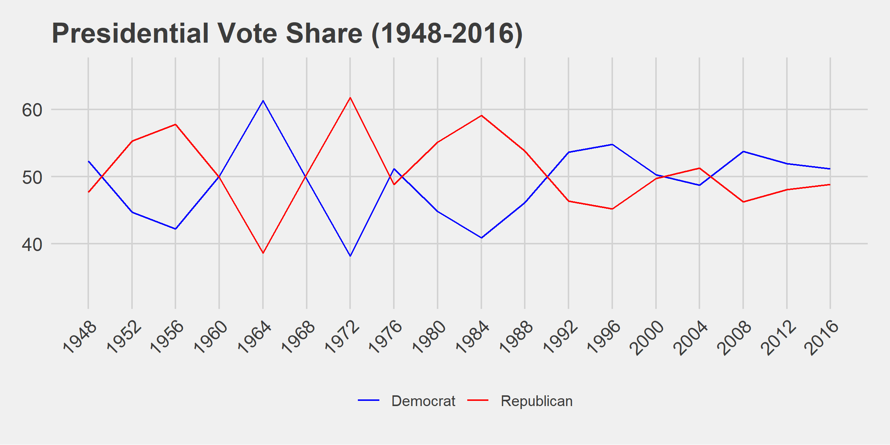
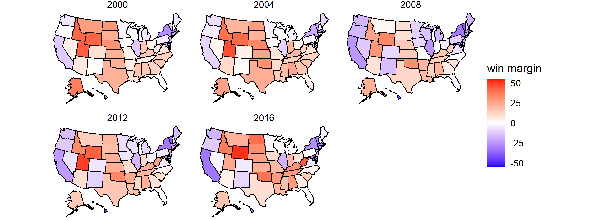
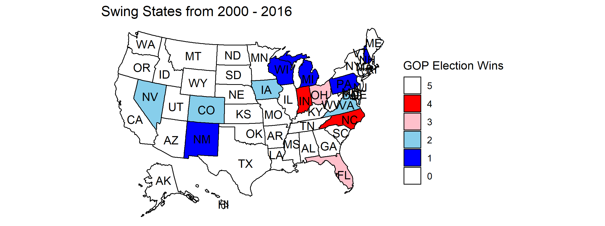

As the contentious 2020 election looms nearer, countless Americans will begin to
make their predictions for election night. In this blog I will discuss insights
from previous elections as well as offer my own predictions for the 2020
presidential election. This introductory post will focus on observational
analysis of previous elections. Specifically, this post will examine historical
trends in the two-party popular vote, two-party popular vote share margin by
state, and swing states.

## The Popular Vote from 1948 - 2016

In recent history, the presidential election has generally been a competitive
affair; candidates from both major parties have won the election and the popular
vote. Only twice in the past 68 years has a candidate won more than 60% of
the two-party popular vote share. Additionally, elections are frequently decided
by only a few popular vote percentage points. However, due to the electoral
college, the share of the popular vote won by each candidate is not the only
measure of an election's outcome. To determine the closeness of past elections,
it may be more beneficial to look at the two-party vote share in each state.

## Popular Vote Margin by State

Viewing the margins of victory in each state instead of the absolute winner
creates an image of America that shows the diversity of opinion that is present
everywhere. It also shows the disparities in voting across different
geographical regions with the middle of the country leaning Republican and the
coasts mostly leaning Democrat. Very few states are dominated by one party and
most are close to evenly split. This image also shows the constantly changing
opinions of Americans. For example, it is easy to see California becoming more
blue in successive years and Wyoming becoming more red. While this clearly
displays the closeness of elections in the United States, it would also be
useful to see which states have actually swung between voting majority
Republican and majority Democrat.

## Swing States in the 21st Century

In the past five elections, only 13 states have voted for both parties at least
once. Of these, only six voted for both parties at least twice: Nevada, Iowa,
Virginia, Ohio, Florida, and Colorado. This shows that while vote margins are
very close in many states, most tend to vote for the same party year after year.
Only a few states frequently swing from a majority voting for one party to the
other. These battleground states are critical in determining the outcome of the
election and deserve increased attention.
