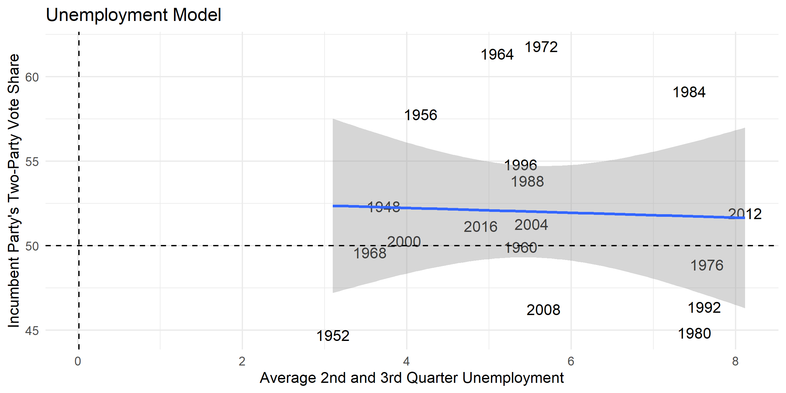
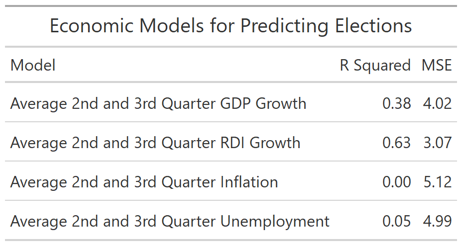

One prominent method for predicting election outcomes is using economic
variables as predictive models. This model, as proposed and discussed by
Christopher H. Achen and Larry M. Bartels in "Democracy for Realists" and Andrew
Healy and Gabriel S. Lenz in "Substituting the End for the Whole: Why Voters
Respond Primarily to the Election-Year Economy", is based on a theory of
retrospective voting behavior. This theory argues that voters consider the past
performance of the incumbent party through variables such as gross domestic
product (GDP) growth and real disposable income (RDI) growth.

In order to use these economic variables as predictors, I will first examine how
well these variables have correlated with voting in past elections.

Judging purely by the images, it appears that unemployment, RDI growth, and GDP
growth all correlate with the incumbent party's vote share. However, we can
actually quantitatively measure how well each of these models fits the data. The
first measure to do this is the r squared statistic which measures the
proportion of the dependent variable's variance that can be explained by the
independent variable. The second measure is the mean squared error (MSE), which is
less intuitively understood, but can be used to compare fitness across models.

From these measures it becomes clear that RDI growth is the best of the above
models. RDI growth in the second and third quarter of the year explains 63% of
the variance in the incumbent party's vote share while GDP growth only explains
38%. Additionally, the MSE of the RDI prediction model was a point lower than
that of the GDP growth rate model. Overall, it appears that historically RDI is
a good predictor of the incumbent party's two-party vote share. Now I will apply
this model to try and predict the 2020 election. To do this I will use second quarter 2020 economic indicators as this is the most recent available data. 

From these predictions it becomes clear that the economic models are not capable
of being used as a good predictor in 2020. The predictions made by both the RDI
and GDP models, 114% and 1.34% of the vote share, are far from any credible
prediction. Furthermore, the range of values predicted by these two models is
well over 50 percentage points. This error in predicting comes from problems
with extrapolation. The values for RDI growth and GDP growth in the second
quarter of 2020, due to coronavirus and subsequent responses to the virus, are
large outliers from previous data. The model designed to fit the historical data
loses its accuracy when applied outside of the range of historical values.
Ultimately, these models tell us that economic indicators alone will not be able
to predict the 2020 election outcome.