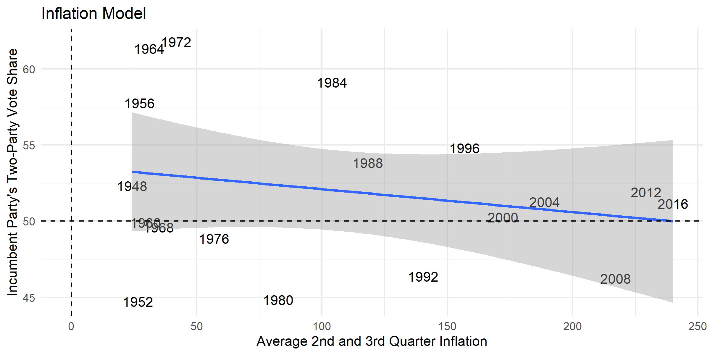

One prominent method for predicting election outcomes is using economic
variables as predictive models. This model, as proposed and discussed by
Christopher H. Achen and Larry M. Bartels in "Democracy for Realists" and Andrew
Healy and Gabriel S. Lenz in "Substituting the End for the Whole: Why Voters
Respond Primarily to the Election-Year Economy", is based on a theory of
retrospective voting behavior. This theory argues that voters consider the past
performance of the incumbent party through variables such as gross domestic
product (GDP) growth and real disposable income (RDI) growth.

In order to use these economic variables as predictors, I will first examine how
well these variables have correlated with voting in past elections.

Judging purely by the images, it appears that unemployment, RDI growth, and GDP growth all correlate with the incumbent party's vote share. However, we can actually quantitatively measure how well each of these models fits the data. The first measure to do this is the r squared statistic which measures the proportion of the dependent variable's variance that can be explained by the independent variable. The second measure is the mean squared error, which is less intuitively understood, but can be used to compare fitness across models. 

