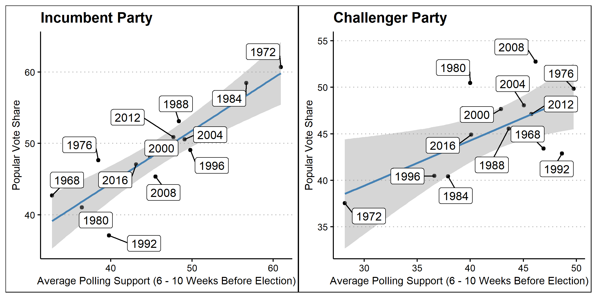
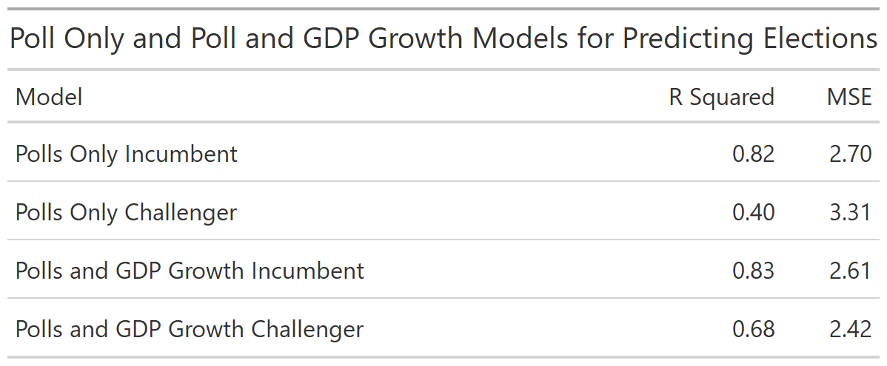

As the 2020 election draws nearer national and state polls will gain increasing attention. Frequently these polls seek to estimate the popular vote share of the presidential election by asking U.S. citizens their voting preference. This week, I will **examine if polls can be used as a good predictor for the actual election outcome.** I will do this by analyzing historical polling and voting data to see if polling has been an effective predictive model in the past for the national election. I will then see if polling data has been an effective predictor of historical state elections. Finally, **I will use the models I create and 2020 polling data to predict this year's election.**

When creating these scatter plots, which visualize the relationship between polling averages and popular vote share, I chose to use historical polling data from 6-10 weeks before the election. I chose to use this month of polling because, as of the writing of this blog, we are approximately six weeks away from the election. I wanted to use this entire month so that there would be a larger sample of polls when estimating the polling average. I also chose to divide incumbents and challengers into separate plots to see if there was a different relationship based on this characteristic. These plots make it clear that **there is some relationship between polling and voting,** but next we must ask how strong this relationship is. 

In order to quantify the relationship between polling data and popular vote share, I created a linear regression. I also created a linear regression which used a combination of GDP growth in the second quarter and poll data in order to compare the effectiveness of these two models. The choice to use GDP growth in the second quarter was based on my previous modeling which showed GDP growth to be a good predictor of election outcomes. When comparing the models in the table above, **it appears that the relationship between polling averages and vote share is more prevalent for the incumbent than the challenger.** Additionally, it appears that using the combined economic and polling data is a more accurate predictor based on the slightly higher R squared scores. However, before concluding that the combined model is better, we should validate the models using out-of-sample evaluation. 

## Model Validation

To avoid the negative effects of overfitting a model it is important to evaluate the model using out-of-sample evaluation. This process involves removing one year of data from the data set, remaking the predictive model, and then testing how well the model predicts the removed data. By repeating this process many times, and seeing if the model correctly predicted the popular vote share winner, we can see how valid each model is. 

The model using just polls predicted the popular vote share winner correctly **90%** of the time while the model using both economic and polling data was correct only **80%** of the time. This suggests that **using only polling data may actually be a better predictive model than using both economic and polling data** despite the difference in R squared values discussed above. 

## State Level Models